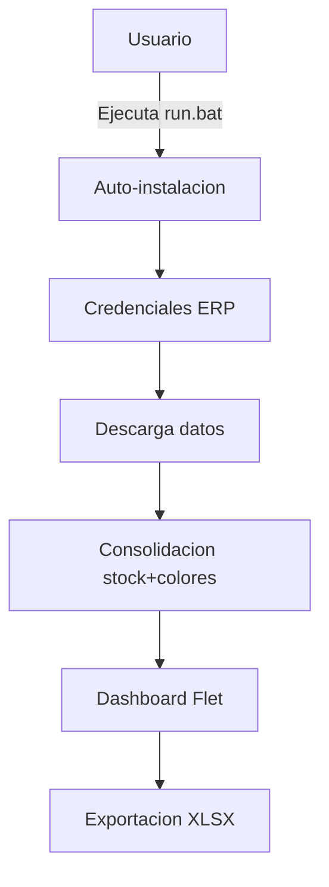

# G360 Stock Color Consolidator

> Consolida stock de colores desde el ERP de CIPSA y exporta a XLSX. Portable v1.1.0.

[](https://github.com/carloscus/g360-erp-stock-consolidator)
[](https://python.org)
[](https://opensource.org/licenses/MIT)



---

## Tabla de Contenidos

- [Descripcion](#descripcion)
- [Caracteristicas](#caracteristicas)
- [Tecnologias](#tecnologias)
- [Instalacion](#instalacion)
- [Uso](#uso)
- [Estructura](#estructura)
- [Archivos importantes](#archivos-importantes)
- [Contribucion](#contribucion)
- [Licencia](#licencia)
- [Familia G360](#familia-g360)

---

## Descripcion

Aplicacion de escritorio portatil que consolida stock de colores desde el ERP de CIPSA. Descarga datos desde dos fuentes (HTTP y Playwright), los consolida y presenta en un dashboard interactivo con exportacion a Excel.

**Tipo**: Desktop App (Portable)
**Framework**: Flet (Flutter-based Python)
**Plataforma**: Windows 10/11

---

## Caracteristicas

- **Auto-instalacion**: `run.bat` instala Python, dependencias y ejecuta la app
- **Dos fuentes de datos**: HTTP (Source 1) y Playwright browser automation (Source 2)
- **5 motores de lectura Excel**: openpyxl, xlrd, csv, html, xml — multi-formato
- **Consolidacion inteligente**: Merge de stock + colores por SKU
- **Dashboard interactivo**: Flet con tema light/dark y glassmorphism
- **Detalle por SKU**: Modal con informacion detallada por producto
- **Exportacion XLSX**: Reporte consolidado con formato profesional
- **Version portable**: Carpeta autonoma para trasladar a cualquier PC

---

## Tecnologias

| Capa | Tecnologia |
|---|---|
| UI | Flet 0.85+ (Flutter-based Python) |
| Core | Python 3.11+ |
| Excel | openpyxl, xlrd |
| Automation | Playwright (Source 2) |
| HTTP | requests |
| Runtime | uv (gestor de paquetes) |

---

## Instalacion

### Requisitos

- Windows 10/11
- Conexion a internet (solo primera ejecucion)
- Red local CIPSA para acceder al ERP

### Rapido

```bash
git clone https://github.com/carloscus/g360-erp-stock-consolidator.git
cd g360-erp-stock-consolidator
run.bat
```

### Manual

```bash
uv venv .venv --python 3.11 --seed
uv sync
.venv\Scripts\python run.py
```

---

## Uso

1. Ejecutar `run.bat` (auto-instala todo)
2. Ingresar credenciales del ERP
3. Descargar datos desde las fuentes
4. Explorar el dashboard consolidado
5. Exportar a Excel desde la interfaz

Para mas detalles, leer `INSTRUCCIONES.txt`.

---

## Estructura

```
g360-erp-stock-consolidator/
├── run.bat                  # Lanzador principal
├── run.py                   # Entry point de la app Flet
├── requirements.txt         # Dependencias Python
├── pyproject.toml           # Configuracion del proyecto
├── src/
│   ├── main.py              # Orquestacion principal de la app
│   ├── config/
│   │   ├── __init__.py
│   │   └── theme.py         # Paletas de colores (LIGHT/DARK)
│   ├── core/
│   │   ├── __init__.py
│   │   ├── constants.py     # Constantes centralizadas
│   │   ├── models.py        # Modelos de datos (dataclasses)
│   │   ├── consolidator.py  # Logica de consolidacion stock+colores
│   │   ├── parsers.py       # Parsers de Source 1 y Source 2
│   │   ├── downloader.py    # Descarga HTTP de Source 1
│   │   ├── browser_automation.py  # Automatizacion Playwright para Source 2
│   │   ├── xls_fallback.py  # Motor multi-formato para leer XLS
│   │   ├── errors.py        # Mensajes de error amigables
│   │   └── report.py        # Generacion de reportes XLSX
│   ├── ui/
│   │   ├── __init__.py
│   │   ├── dashboard.py     # Interfaz principal (Flet)
│   │   ├── sku_detail.py    # Modal de detalle por SKU
│   │   └── logo.py          # Logos en base64
│   └── test_app.py          # Tests unitarios
├── assets/
│   └── images/              # Logos e iconos
└── samples/                 # Archivos de prueba
```

---

## Archivos importantes

| Archivo | Proposito |
|--------|----------|
| `run.bat` | Lanzador principal (doble clic) |
| `.env` | Configuracion de red local (URL del ERP) |
| `.env.example` | Plantilla para crear `.env` |
| `run_log.txt` | Bitacora de errores (se genera al ejecutar) |
| `INSTRUCCIONES.txt` | Manual de usuario detallado |

---

## Contribucion

1. Fork el repositorio
2. Crea una rama (`git checkout -b feature/nueva-funcion`)
3. Commit cambios (`git commit -m 'Agregar funcion'`)
4. Push a la rama (`git push origin feature/nueva-funcion`)
5. Abre un Pull Request

---

## Licencia

MIT License - ver [LICENSE](LICENSE) para mas detalles.

---

## Familia G360

Este proyecto forma parte de la familia de microherramientas **G360** para apoyo CRM y gestion de datos en escritorio, enfocadas en areas como ventas, finanzas y logistica.

### Herramientas Relacionadas

- **[g360-cli](https://github.com/carloscus/g360-cli)**: Bootstrap de proyectos G360
- **[g360-signature](https://github.com/carloscus/g360-signature)**: Web component de branding
- **[g360-order-xlsx](https://github.com/carloscus/g360-order-xlsx)**: Procesador de cotizaciones Excel
- **[g360-signature-creator](https://github.com/carloscus/g360-signature-creator)**: Generador de firmas corporativas

---

**Marca**: G360
**Isotipo**: 3 puntos verticales paralelos (gris-verde-gris) + chevron `>`
**Autor**: Carlos Cusi
**Desarrollo**: Con asistencia de herramientas de codigo IA (Vibe Code)
**Powered by**: [g360-signature](https://github.com/carloscus/g360-signature)
