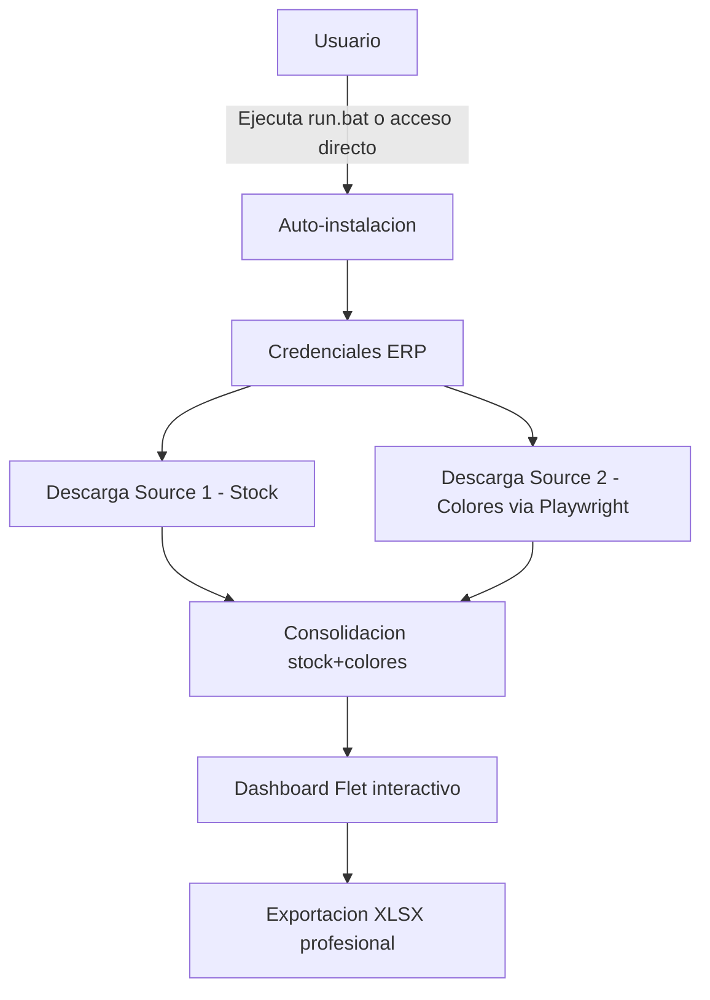

# G360 Stock Color Consolidator

> Consolida stock de colores desde el ERP de CIPSA y exporta a XLSX. Portable v1.2.0 — Flet Polished.

[](https://github.com/carloscus/g360-erp-stock-consolidator)
[](https://python.org)
[](https://flet.dev)
[](https://opensource.org/licenses/MIT)



---

## Tabla de Contenidos

- [Descripcion](#descripcion)
- [Caracteristicas](#caracteristicas)
- [Tecnologias](#tecnologias)
- [Instalacion](#instalacion)
- [Uso](#uso)
- [Estructura del proyecto](#estructura-del-proyecto)
- [Archivos importantes](#archivos-importantes)
- [Flujo de credenciales](#flujo-de-credenciales)
- [Busqueda global](#busqueda-global)
- [Contribucion](#contribucion)
- [Licencia](#licencia)
- [Familia G360](#familia-g360)

---

## Descripcion

Aplicacion de escritorio portatil que consolida stock de colores desde el ERP de CIPSA. Descarga datos desde dos fuentes (HTTP y Playwright browser automation), los consolida y presenta en un dashboard interactivo con exportacion a Excel.

**Tipo**: Desktop App (Portable)
**Framework**: Flet 0.28.3 (Flutter-based Python)
**Plataforma**: Windows 10/11
**Modo**: Light/Dark con glassmorphism

---

## Caracteristicas

- **Auto-instalacion**: `run.bat` instala Python, dependencias y Chromium para Playwright
- **Lanzador VBS**: `launch.vbs` minimiza la consola a la taskbar (icono clickeable)
- **Acceso directo**: `create_shortcut.vbs` crea icono en el escritorio
- **Dos fuentes de datos**: HTTP (Source 1) y Playwright browser automation (Source 2)
- **5 motores de lectura Excel**: openpyxl, xlrd, csv, html, xml — multi-formato
- **Consolidacion inteligente**: Merge de stock + colores por SKU con alertas automaticas
- **Dashboard interactivo**: Flet con tema light/dark, paginacion, filtros y sidebar de almacenes
- **Busqueda global**: Overlay con resultados en tiempo real, navegacion por teclado
- **Detalle por SKU**: Modal con desglose visual por color y modelo
- **KPIs interactivos**: Total, con stock, sin stock, traslados — clic para filtrar
- **Modales con overlay**: Click fuera cierra cualquier modal
- **Exportacion XLSX**: Dos hojas (Con Color / Sin Color) con formato profesional
- **Version portable**: `sync_portable.py` + `build-portable.bat` para distribucion

---

## Tecnologias

| Capa | Tecnologia |
|---|---|
| UI | Flet 0.28.3 (Flutter-based Python) |
| Core | Python 3.11+ |
| Excel | openpyxl, xlrd |
| Automation | Playwright 1.62 (Source 2) |
| HTTP | requests |
| Parseo HTML | BeautifulSoup4 + lxml |
| Runtime | uv (gestor de paquetes) |

---

## Instalacion

### Requisitos

- Windows 10/11
- Conexion a internet (solo primera ejecucion)
- Red local CIPSA para acceder al ERP

### Rapido

```bash
git clone https://github.com/carloscus/g360-erp-stock-consolidator.git
cd g360-erp-stock-consolidator
run.bat
```

### Manual

```bash
uv venv .venv --python 3.11 --seed
uv sync
uv run playwright install chromium
uv run python run.py
```

### Acceso directo en escritorio

```bash
cscript //nologo create_shortcut.vbs
```

### Lanzador minimizado

```bash
cscript //nologo launch.vbs
```

Ejecuta la app con la consola minimizada en la taskbar. Hacer clic en el icono para ver logs.

---

## Uso

1. Ejecutar `run.bat` (auto-instala todo) o el acceso directo del escritorio
2. En la primera ejecucion, ingresar credenciales del ERP CIPSA
3. Descargar datos:
   - **S1 - Stock**: Descarga el reporte de stock desde el servidor HTTP
   - **S2 - Color**: Automatiza el navegador para descargar colores desde el ERP
   - O cargar **S2 manualmente** desde un archivo .xls/.xlsx local
4. Usar la **busqueda global** para encontrar productos por SKU o descripcion
5. Explorar el dashboard consolidado con filtros y ordenamiento
6. Exportar a Excel desde el boton de descarga

---

## Estructura del proyecto

```
g360-erp-stock-consolidator/
├── run.bat                    # Lanzador principal (doble clic)
├── run.py                     # Entry point de la app Flet
├── launch.vbs                 # Lanzador minimizado (consola en taskbar)
├── launch_minimized.bat       # Delega a launch.vbs
├── create_shortcut.vbs        # Crea acceso directo en escritorio
├── build-portable.bat         # PyInstaller onefile + windowed
├── sync_portable.py           # Sincroniza con carpeta portable
├── pyproject.toml             # Configuracion del proyecto (deps + version)
├── requirements.txt           # Dependencias legacy
├── .env.example               # Plantilla de variables de entorno
├── skill.json                 # Skill G360 metadata
│
├── src/
│   ├── main.py                # Orquestacion principal de la app
│   ├── test_app.py            # Tests unitarios (14 tests)
│   │
│   ├── config/
│   │   └── theme.py           # Paletas LIGHT/DARK + KPI config
│   │
│   ├── core/
│   │   ├── constants.py       # Constantes centralizadas
│   │   ├── models.py          # Modelos de datos (dataclasses)
│   │   ├── consolidator.py    # Logica de consolidacion stock+colores
│   │   ├── parsers.py         # Parsers de Source 1 y Source 2
│   │   ├── downloader.py      # Descarga HTTP de Source 1
│   │   ├── browser_automation.py  # Automatizacion Playwright para Source 2
│   │   ├── xls_fallback.py    # Motor multi-formato para leer XLS
│   │   ├── errors.py          # Mensajes de error amigables
│   │   ├── helpers.py         # Funciones auxiliares
│   │   └── report.py          # Generacion de reportes XLSX
│   │
│   └── ui/
│       ├── dashboard.py       # Interfaz principal (Flet)
│       ├── search_overlay.py  # Busqueda global con overlay
│       ├── sku_detail.py      # Modal de detalle por SKU
│       ├── logo.py            # Logo CIPSA en base64
│       └── modals/
│           ├── sin_stock_modal.py    # Modal productos sin stock
│           └── traslados_modal.py    # Modal pendientes de transferencia
│
├── g360_flet/
│   └── g360_signature.py      # Widget branding G360 (isotipo + texto)
│
├── assets/
│   └── images/                # Logo, iconos, favicon
│
└── samples/                   # Archivos de prueba
```

---

## Archivos importantes

| Archivo | Proposito |
|--------|----------|
| `run.bat` | Lanzador principal (doble clic) — auto-instala y ejecuta |
| `launch.vbs` | Lanzador minimizado — consola visible en taskbar |
| `create_shortcut.vbs` | Crea acceso directo en escritorio |
| `build-portable.bat` | Genera ejecutable standalone con PyInstaller |
| `sync_portable.py` | Sincroniza proyecto con carpeta portable |
| `.env` | Configuracion de red local (URL del ERP) |
| `.env.example` | Plantilla para crear `.env` |
| `run_log.txt` | Bitacora de errores (se genera al ejecutar) |
| `INSTRUCCIONES.txt` | Manual de usuario detallado |

---

## Flujo de credenciales

1. **Primera ejecucion**: Dialog LOGIN pide usuario y contraseña del ERP
2. **Cacheo seguro**: El **usuario** se guarda en `%APPDATA%\g360-stock-consolidator\creds.json`. La **contraseña NO se cachea** por seguridad
3. **Descarga S2**: Si no hay contraseña cacheada, se pide automaticamente al hacer click en "S2 - Color"
4. **Flujo automatico**: Click "Guardar y descargar" → credenciales guardadas → descarga inicia
5. **Credenciales invalidas**: Dialog con opciones "Cambiar credenciales" o "Cargar manualmente"
6. **Cambio manual**: Click en icono candado en la barra superior

---

## Busqueda global

El campo de busqueda en el sidebar ofrece una experiencia global:

- **Overlay flotante** que aparece al escribir (minimo 2 caracteres)
- Cada resultado muestra: SKU, descripcion, almacenes con stock, stock disponible
- **Navegacion por teclado**: ArrowUp/Down para navegar, Enter para abrir detalle, Escape para cerrar
- **Click en resultado** abre el modal "Detalle por almacen" con todas las existencias
- Los resultados se actualizan en tiempo real mientras se escribe

---

## Contribucion

1. Fork el repositorio
2. Crea una rama (`git checkout -b feature/nueva-funcion`)
3. Commit cambios (`git commit -m 'Agregar funcion'`)
4. Push a la rama (`git push origin feature/nueva-funcion`)
5. Abre un Pull Request

---

## Licencia

MIT License - ver [LICENSE](LICENSE) para mas detalles.

---

## Familia G360

Este proyecto forma parte de la familia de microherramientas **G360** para apoyo CRM y gestion de datos en escritorio, enfocadas en areas como ventas, finanzas y logistica.

### Herramientas Relacionadas

- **[g360-cli](https://github.com/carloscus/g360-cli)**: Bootstrap de proyectos G360
- **[g360-signature](https://github.com/carloscus/g360-signature)**: Web component de branding
- **[g360-order-xlsx](https://github.com/carloscus/g360-order-xlsx)**: Procesador de cotizaciones Excel
- **[g360-signature-creator](https://github.com/carloscus/g360-signature-creator)**: Generador de firmas corporativas

---

**Marca**: G360
**Isotipo**: 3 puntos verticales paralelos (gris-verde-gris) + chevron `>`
**Autor**: Carlos Cusi
**Version**: 1.2.0 (Flet Polished)
**Desarrollo**: Con asistencia de herramientas de codigo IA (Vibe Code)
**Powered by**: [g360-signature](https://github.com/carloscus/g360-signature)
